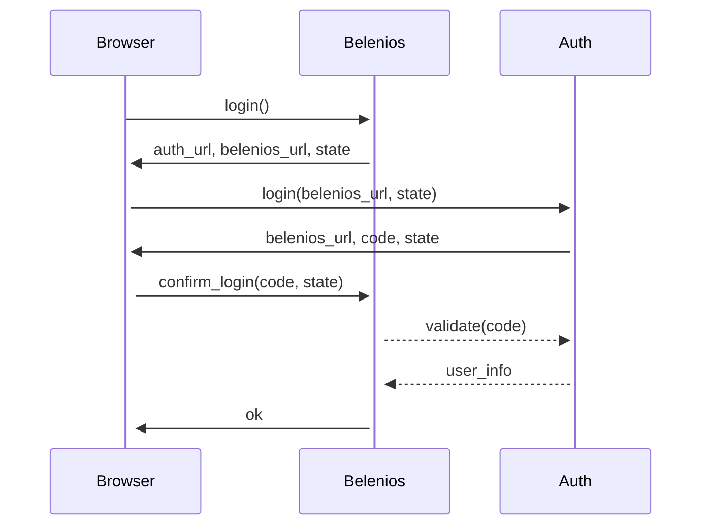
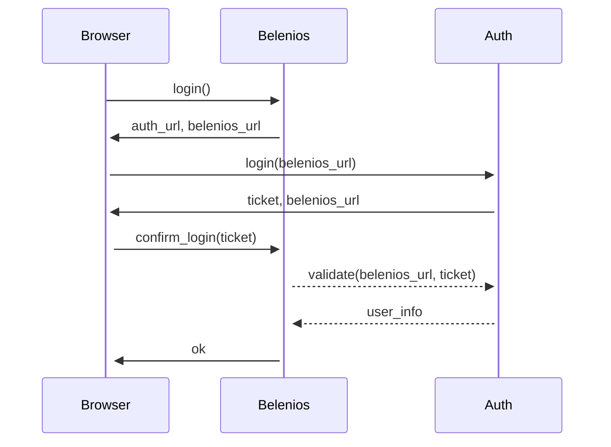
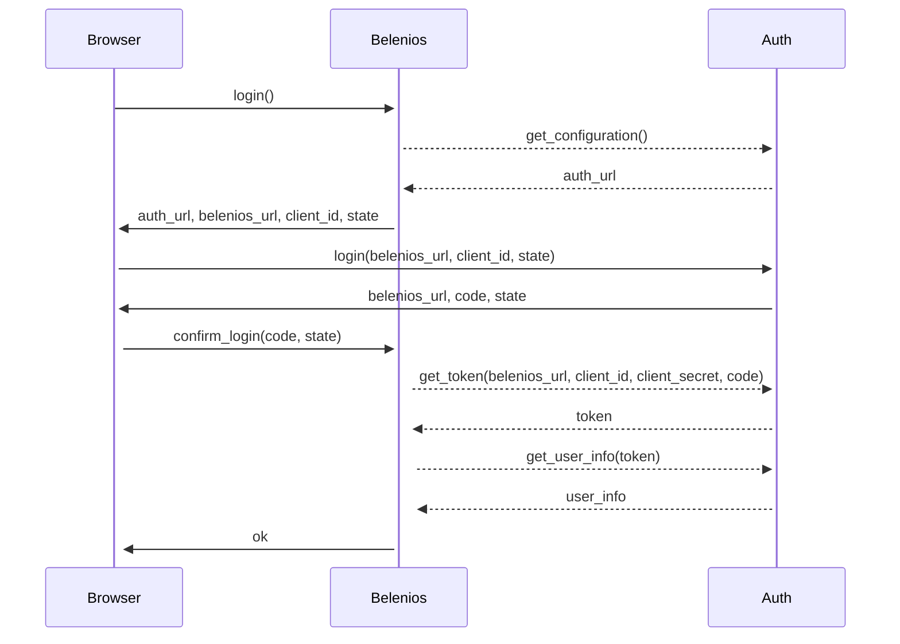

# Authentication in Belenios

The Belenios web server supports several authentication schemes,
declared in the configuration file. Examples are given in the [sample
configuration file](../demo/ocsigenserver.conf.in).

The general format of an authentication scheme for administrators is:

```xml
<auth name="example">...</auth>
```

This declares an `example` scheme. `...` depends on the specific
protocol used. There can be several instances of `<auth>`, but they
must have different names.

The general format of an authentication scheme for voters is very
similar but uses `<auth-export>` instead of `<auth>`.

# External authentication protocols supported by Belenios

Here, we give synthetic sequence diagrams for the authentication
protocols supported by Belenios as a _service provider_ involving an
external _identity provider_. These diagrams can help in understanding
the implementations.

## Belenios Connect

[Implementation](../src/web/server/common/web_auth_belenios.ml)



This protocol is a simplified OpenID Connect tailored for
Belenios. Its configuration (`...` inside the `<auth>` or
`<auth-export>` above) has the following format:

```xml
<belenios server="..." callback="..."/>
```

where `server` is the base URL of the identity provider (from which
`auth_url` is derived), and `callback` a name identifying the service
provider (from which `belenios_url` is derived).

The initial motivation for introducing this protocol was to allow one
Belenios instance to delegate its authentification to another Belenios
instance. For this, an identity provider is also implemented in
Belenios. It can be enabled with the `<connect>` element in the
configuration file:

```xml
<connect>
  <callback1 address="..."/>
  ...
</connect>
```

where `callback1` is the name used in the `callback` attribute of the
service provider and `address` the associated URL. There can be
several children to the `<connect>` element, one per allowed service
provider.

For a Belenios instance whose public URL is `$PREFIX`, the identity
provider base URL is `$PREFIX/connect` and the callback URL is
`$PREFIX/auth/belenios`.

## CAS (Central Authentication Service)

[Implementation](../src/web/server/common/web_auth_cas.ml)

This protocol is widely used in universities. See
[Wikipedia](https://en.wikipedia.org/wiki/Central_Authentication_Service)
for a summary, and the [reference
implementation](https://github.com/apereo/cas) for a full
specification.



The configuration has the following format:

```xml
<cas server="..."/>
```

## OpenID Connect

[Implementation](../src/web/server/common/web_auth_oidc.ml)

This protocol based on OAuth is widely used in general-purpose on-line
services. The full specification is available on the [OpenID
website](https://openid.net/developers/specs/).



The configuration has the following format:

```xml
<oidc server="..." client_id="..." client_secret="..."/>
```
