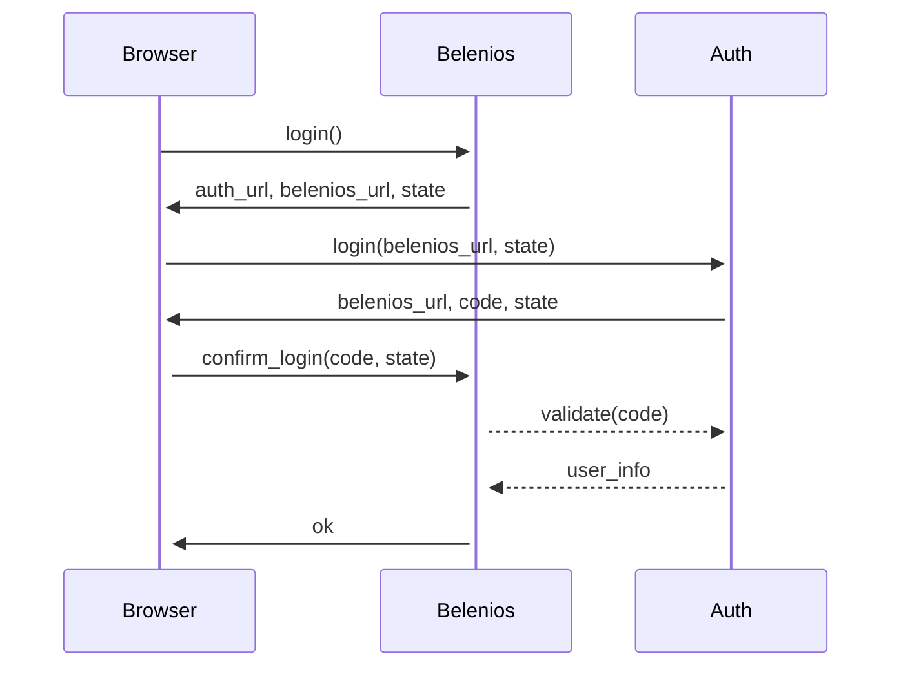
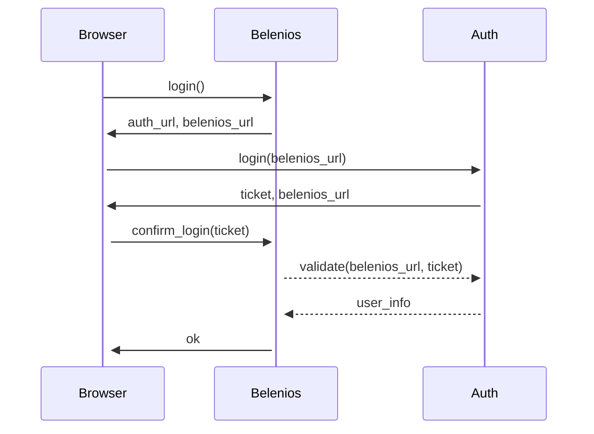
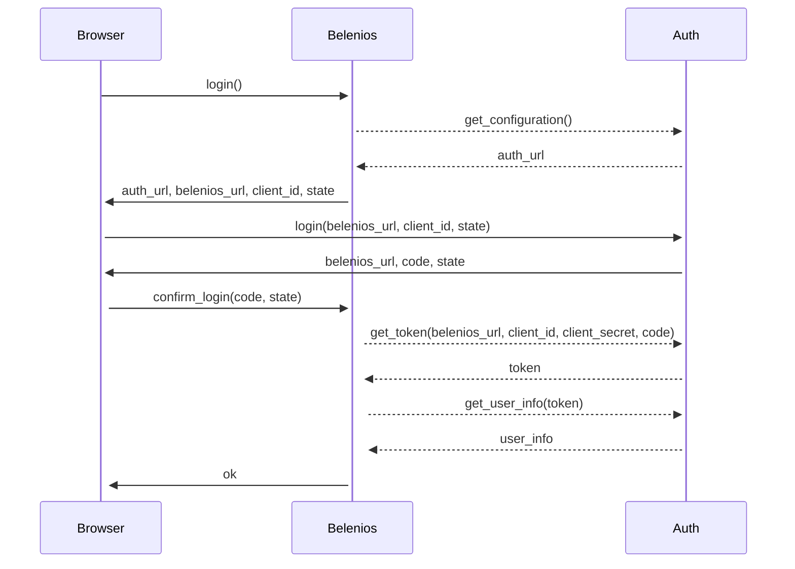

# External authentication protocols supported by Belenios

## Belenios Connect

```mermaid
sequenceDiagram
    Browser->>+Belenios: login()
    Belenios->>+Browser: auth_url, belenios_url, state
    Browser->>+Auth: login(belenios_url, state)
    Auth->>+Browser: belenios_url, code, state
    Browser->>+Belenios: confirm_login(code, state)
    Belenios-->>+Auth: validate(code)
    Auth-->>+Belenios: user_info
    Belenios->>+Browser: ok
```

## CAS

```mermaid
sequenceDiagram
    Browser->>+Belenios: login()
    Belenios->>+Browser: auth_url, belenios_url
    Browser->>+Auth: login(belenios_url)
    Auth->>+Browser: ticket, belenios_url
    Browser->>+Belenios: confirm_login(ticket)
    Belenios-->>+Auth: validate(belenios_url, ticket)
    Auth-->>+Belenios: user_info
    Belenios->>+Browser: ok
```

## OpenID Connect

```mermaid
sequenceDiagram
    Browser->>+Belenios: login()
    Belenios-->>+Auth: get_configuration()
    Auth-->>+Belenios: auth_url
    Belenios->>+Browser: auth_url, belenios_url, client_id, state
    Browser->>+Auth: login(belenios_url, client_id, state)
    Auth->>+Browser: belenios_url, code, state
    Browser->>+Belenios: confirm_login(code, state)
    Belenios-->>+Auth: get_token(belenios_url, client_id, client_secret, code)
    Auth-->>+Belenios: token
    Belenios-->>+Auth: get_user_info(token)
    Auth-->>+Belenios: user_info
    Belenios->>+Browser: ok
```
