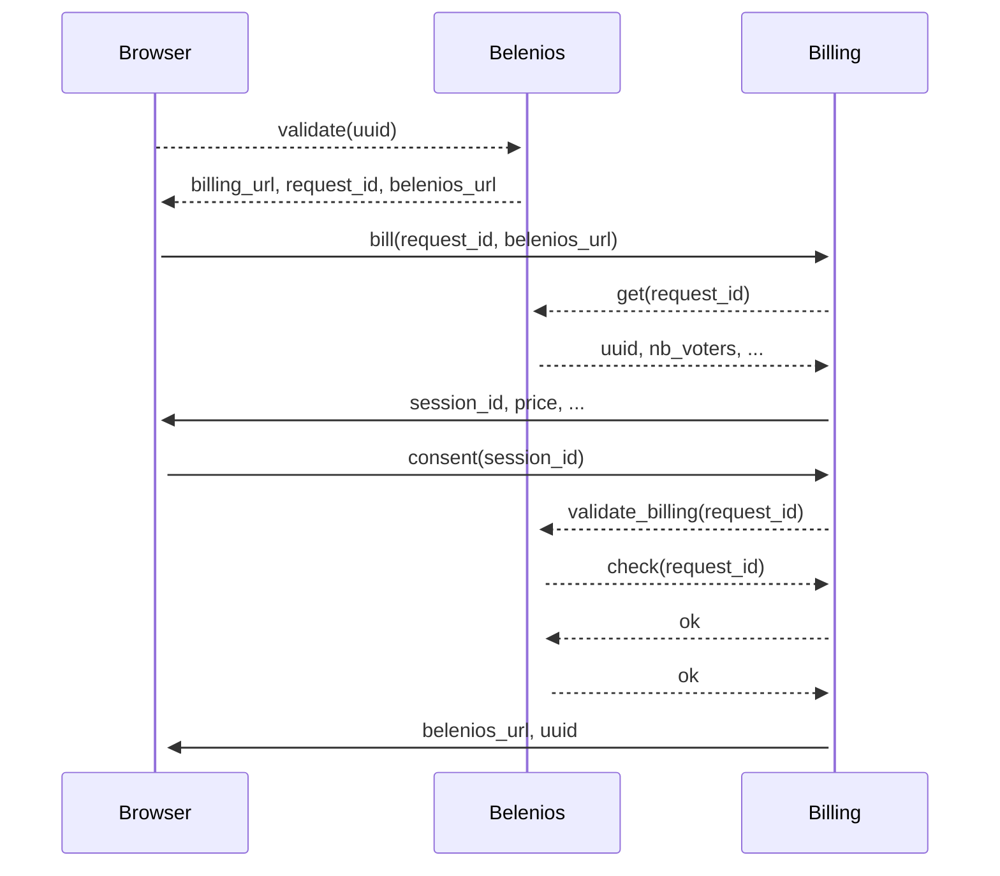

# Belenios billing protocol

```mermaid
sequenceDiagram
    Browser-->>+Belenios: validate(uuid)
    Belenios-->>+Browser: billing_url, request_id, belenios_url
    Browser->>+Billing: bill(request_id, belenios_url)
    Billing-->>+Belenios: get(request_id)
    Belenios-->>+Billing: uuid, nb_voters, ...
    Billing->>+Browser: session_id, price, ...
    Browser->>+Billing: consent(session_id)
    Billing-->>+Belenios: validate_billing(request_id)
    Belenios-->>+Billing: check(request_id)
    Billing-->>+Belenios: ok
    Belenios-->>+Billing: ok
    Billing->>+Browser: belenios_url, uuid
```
