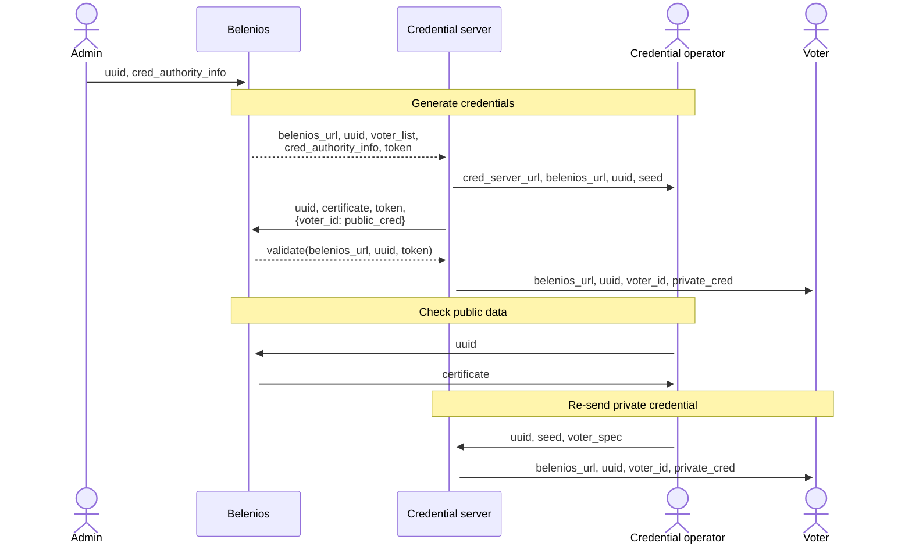

# Credential authority protocol

## Introduction and rationale

This protocol was introduced in Belenios 3.2. The credential authority
role of the abstract protocol (as described in the Belenios
specification) is split in two roles:

- a _credential operator_, typically a human, whose role is to:
  - keep a cryptographic seed safe
  - perform verifications
  - gatekeep credential recovery requests
- a _credential server_, who acts as:
  - a long-term store for encrypted private credentials
  - a proxy between the credential operator and voters

The rationale is to simplify the operator's role so that it can be
played by a non-technical person. The server handles the technical
part (storing and sending private credentials). Despite its name, the
server does not need to be always online and could even be a native
application running on the operator's computer. However, the split was
done with a typical Web architecture in mind, where the operator only
uses a browser and trusts the server to provide a Web application.

## General sequence diagram

In exchange 1, the election administrator sets the credential
authority information, which Belenios uses to send to the credential
server (exchange 2) a credential generation request.

The credential server then generates a seed and sends it to the
credential operator (exchange 3). This seed is used to derive two
asymmetric keypairs, one for signature and one for encryption. The
server then proceeds to generate the credentials and a certificate
with:

- the uuid of the election
- the length of the voter list
- the hash of public credentials, as they will be published in public
  data
- the signature verificaton key
- the encryption key
- a signature of all the above items

It sends this certificate and the public credentials to Belenios
(exchange 4), and, when the election is validated (exchange 5), the
private credentials are sent to the voters (exchange 6).

The credential server stores the private credentials encrypted with
the key derived from the seed, then forgets the plaintext private
credentials and the seed.

At any time, the credential operator can check the certificate, using
the seed (exchanges 7-8).

If needed, the credential operator can make the server re-send a
private credential to a specific voter by supplying it with the seed
(exchanges 9-10).

Note that, if honest, the credential server "knows" the private
credentials only in limited timeframes. The goal is to to limit the
attack surface: a security assumption is that the credential server is
not compromised when it processes private credentials (in particular
during the election setup). In case a compromission is detected
outside of these critical timeframes, the credential operator must be
notified and stop re-send requests.

## Possible configurations

Although the credential authority protocol aims at implementing an
external credential authority, one may object that it introduces two
new roles, and wonder if these new roles can be played by existing
actors. In the following, we comment on some possibilities.

### Case 1: operator is admin, server is Belenios

This case is a slight evolution of the pre-3.2 mode where credentials
were generated by the Belenios server. The private credentials were
stored in plaintext on the server during the whole setup and the
administrator was invited to download them. They were deleted once the
setup was completed (i.e. on validation), and recovery then relied on
the election administrator keeping the file.

With this new mode, the election administrator only has to hold a
seed. If they lose it, credential recovery will be impossible, in the
same way as if they lost the private credential file in the former
mode.

### Case 2: operator runs server on-demand

This can be implemented by the operator running the server as a native
application on their own computer (exchange 2 would rather be targeted
directly at the credential operator). At a high level, this case
resembles the pre-3.2 mode with an external credential authority. Like
the former mode, this new one can be impractical when there are many
voters, as sending a large amount of messages can take time and may
require the operator to stay online for a long time.

### Case 3: separate credential server

Ideally, the credential server is always online and administered
independently from the Belenios server. Note that since it is accessed
only by the credential operator, it can be more hardened than the
Belenios server which must be accessible by everyone.
